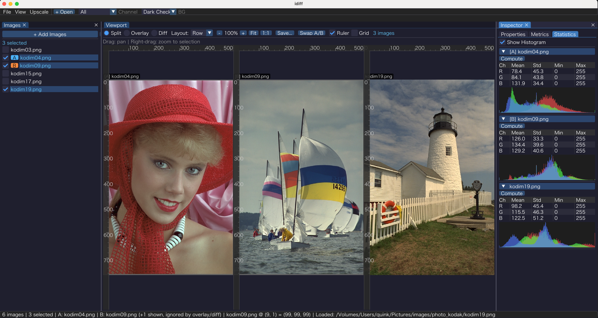
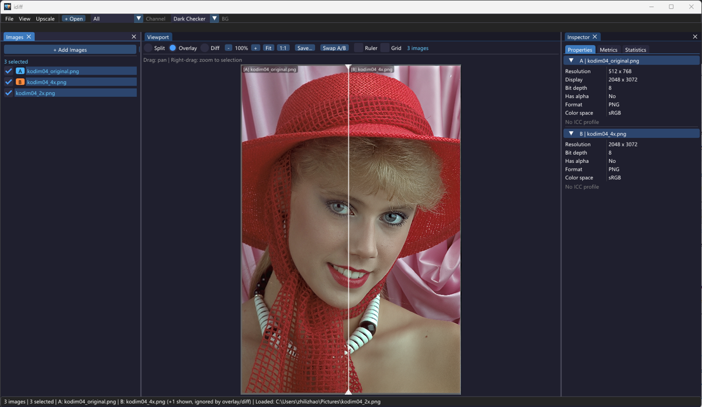
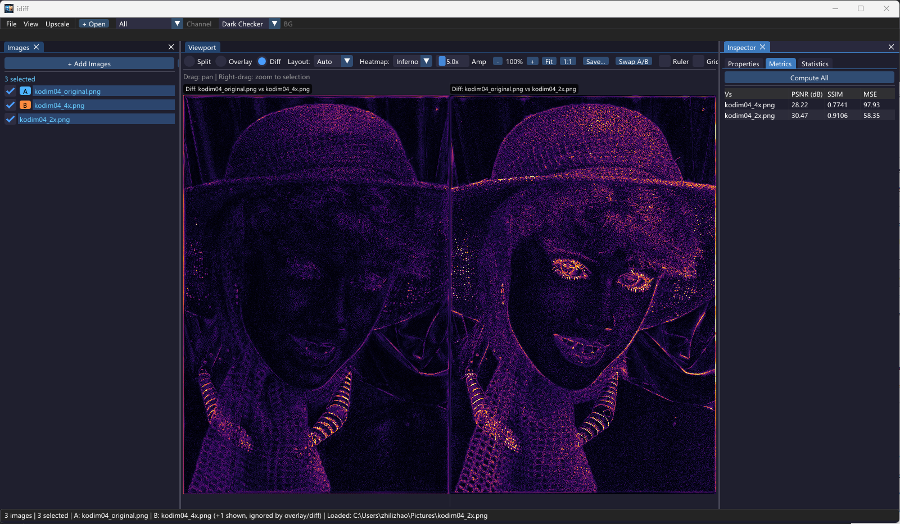
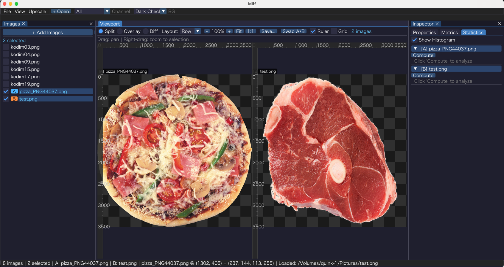
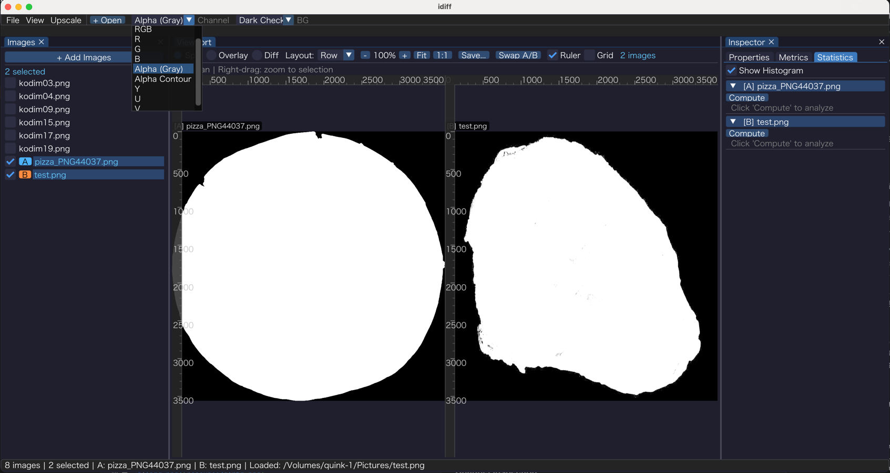
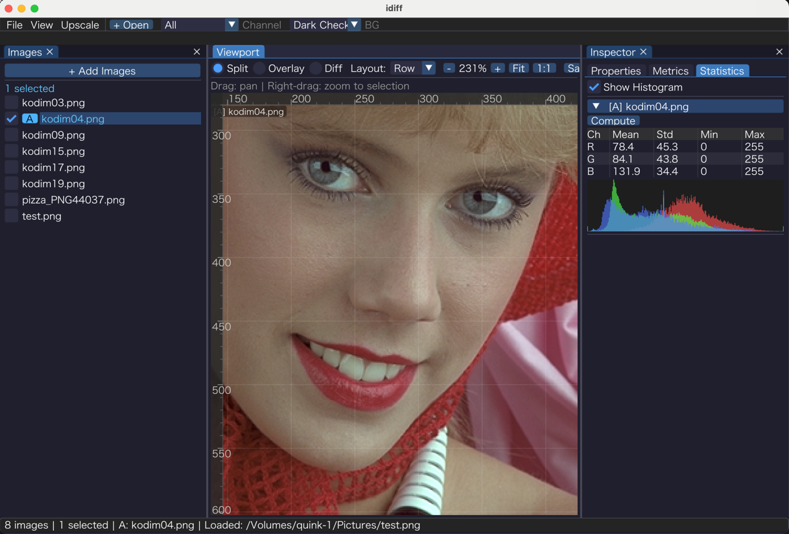

# idiff

Cross-platform media (image + video) comparison tool.



## Features

### Comparison Modes

- **Split** — side-by-side grid, auto-upscales different-resolution images (Lanczos / Nearest / Bilinear / Area)
- **Overlay** — slider with drag handle that wipes between the reference image and any other selected image
- **Difference** — pixel-level heatmap of the reference vs every other selected image, with adjustable amplification and color scheme (Inferno / Viridis / Magma / Turbo / Coolwarm)

The **reference image** (smallest selected index, tagged `[Ref]` in the
image list) feeds Overlay and Difference. Right-click any row and
choose **Mark as Reference** to promote it to the top of the list.
The image-list header offers a grouping combo (**No Grouping** /
**Group by Name** / **Group by Folder**): group by filename stem so
same-named files across directories compare as a unit, or by parent
directory for same-folder batches.





### Quality Metrics

- PSNR, SSIM, MSE per-pair and per-image
- Per-channel statistics (mean, stddev, min, max, variance)
- Histogram visualization
- Cached computation — flip tabs without recomputation

### Pixel Inspector

- Sample every selected image at a shared coordinate and read back
  R/G/B (or Y/U/V) values in a multi-row table
- Manual coordinate entry alongside hover-driven sampling
- Per-channel delta between RGB and RGBA samples; cross-kind
  comparisons (e.g. RGB vs YUV) are refused instead of printing
  meaningless numbers

### Reload

- File watcher detects on-disk changes and surfaces a reload dialog
- `Reload` and `Reload All` entries in the image list right-click
  menu, plus a Reload button in the toolbar
- Video reloads honor the new file contents instead of replaying
  cached frames

### Video

- **Container formats** (MP4, MKV, MOV, …) via FFmpeg ≥ 8.0, including
  10-bit HDR / wide-gamut content (color-managed to display sRGB)
- **Timeline** — scrub, frame stepping, and auto-playback with an
  editable fps (Space toggles play/pause, ←/→ step one frame)
- **Anamorphic (SAR) content** — display-space handling kept correct
  for the pixel inspector, rulers, and status bar
- **Raw YUV video streams** — configurable resolution, pixel format,
  frame stepping (requires FFmpeg)

### Image Support

- **Formats**: PNG, JPEG, WebP, TIFF, BMP, RAW (via LibRaw, optional), HEIF/AVIF (via FFmpeg ≥ 8.0, or ImageMagick 7+ as fallback)
- **ICC color profile** detection and display
- **HTTP/HTTPS URLs** — automatic download with on-disk cache and background prefetch
- **Drag-and-drop** files or comparison-config JSON into the window

### Channel Inspection

- R, G, B single-channel views
- Alpha channel (grayscale or contour)
- YUV planar channels (Y, U, V)
- RGB composite (drop alpha)





### Viewport Tools

- **Ruler** — pixel-coordinate rulers anchored to cell edges
- **Grid overlay** — configurable columns / rows
- **Zoom** — fit, 1:1, scroll-wheel, or toolbar buttons
- **Pan** — click-drag to pan
- **Save viewport** — export current Split / Overlay / Diff view to PNG or JPEG at full image resolution



### Comparison Config

Load a JSON file to batch-compare groups of images (local paths or URLs):

```json
{
  "groups": [
    {
      "name": "Model A vs B",
      "images": [
        { "url": "https://example.com/ground_truth.png", "title": "GT" },
        { "url": "https://example.com/model_a.png", "title": "Model A" },
        { "url": "https://example.com/model_b.png", "title": "Model B" }
      ]
    }
  ]
}
```

Open via `File > Open Comparison Config...` or drag the JSON into the window. Adjacent groups are prefetched in the background.

## Agent Control (JSON-RPC + MCP)

Every running window hosts a JSON-RPC 2.0 server —
`/tmp/idiff-<pid>.sock` on POSIX, `\\.\pipe\idiff-<pid>` on Windows —
so external clients (scripts, AI agents) can load media, drive the
selection, change views, take screenshots, and read state back through
the same code paths the GUI uses. `tools/idiff-mcp/` ships a Python
MCP bridge for MCP-capable agents; it auto-discovers running
instances, or pin one with `IDIFF_PID=<pid>`. See
`docs/rpc-design.md` for the wire format and full method reference.

## Build

### Prerequisites

- CMake 3.20+
- C++17 compiler
- OpenCV 4.x (with imgcodecs and quality module from opencv_contrib)
- SDL2
- FFmpeg 8.0+ (optional — video containers, raw YUV, native HEIF/AVIF; see notes below per platform)
- LibRaw (optional — required for camera RAW formats: .dng, .cr2, .nef, ...)
- ImageMagick 7+ (optional — preferred loader for ICC profiles and wider format coverage)
- vcpkg (recommended on Windows)

### macOS

```bash
brew install opencv libraw sdl2 imagemagick ffmpeg
cmake -B build -DCMAKE_BUILD_TYPE=Release
cmake --build build -j$(sysctl -n hw.ncpu)
```

### Linux (Ubuntu/Debian)

```bash
sudo apt install libopencv-dev libopencv-contrib-dev libraw-dev libsdl2-dev libmagick++-dev
cmake -B build -DCMAKE_BUILD_TYPE=Release
cmake --build build -j$(nproc)
```

FFmpeg ≥ 8.0 is not in Ubuntu's apt repositories (they ship 6.x), so
install it from a PPA or build it from source to enable video /
HEIF/AVIF support; alternatively configure with
`-DIDIFF_WITH_FFMPEG=OFF` for a video-free build (HEIF/AVIF then
depends on ImageMagick's libheif delegate).

### Windows (vcpkg)

```cmd
set VCPKG_ROOT=C:\path\to\vcpkg
cmake -B build -DCMAKE_TOOLCHAIN_FILE=%VCPKG_ROOT%/scripts/buildsystems/vcpkg.cmake
cmake --build build --config Release
```

## Usage

```bash
# Open with no images
./build/src/app/idiff

# Open with images from command line
./build/src/app/idiff image_a.png image_b.png

# Open a comparison config
./build/src/app/idiff comparison.json
```

### Keyboard Shortcuts

| Shortcut | Action |
|---|---|
| `Ctrl+O` | Open images |
| `Ctrl+S` | Save viewport |
| `F5` | Reload all |
| `0` / `F` | Fit to content |
| `1`–`9` | Channel view (1=all, 2=RGB, 3=R, 4=G, 5=B, 6=Alpha, 7=Alpha contour, 8=Y, 9=U) |
| `Space` | Timeline play/pause (with multi-frame media loaded) |
| `←` / `→` | Step one frame (with multi-frame media loaded) |
| `Esc` | Cancel selection |
| Double-click | Fit to content |

Mouse: scroll to zoom, drag to pan.

## Testing

```bash
cmake --build build --target idiff_tests
cd build && ctest --output-on-failure
```

## License

MIT
